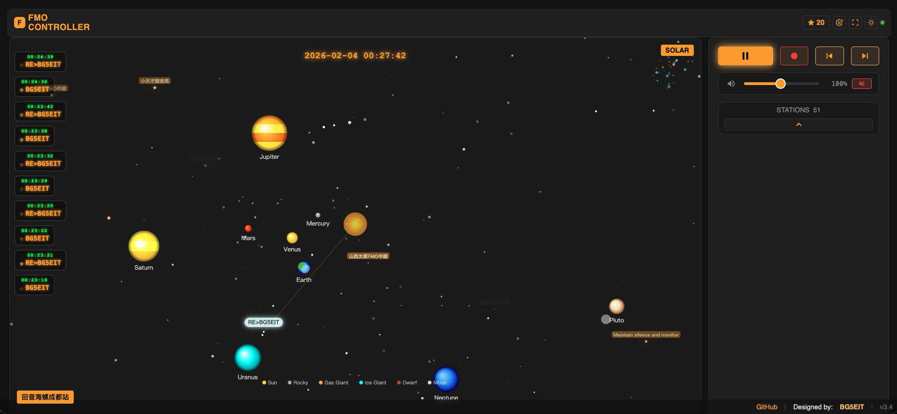

# FMO Mobile Controller

FMO Mobile Controller 是一个基于 Web 技术构建的现代化移动端控制台，专为 FMO 音频系统设计。它提供实时音频流播放、可视化频谱分析、远程设备控制以及 QSO 日志地图展示功能。

（单文件维护起来太累了，毕竟ai写，小功能都要从头读一遍，token消耗量惊人。。。穷了啊）

本项目采用响应式设计，既可直接在浏览器中运行，也支持通过 Cordova 打包为 Android/iOS 原生应用。
演示网站：http://180.76.54.163




## ✨ 主要特性

- **实时音频与可视化**
  - 基于 Web Audio API 的低延迟音频流播放。
  - 多模式可视化引擎 (`visualizer.js`)：支持频谱图 (Spectrum)、太阳系 (Solar System) 等多种视觉效果。
  - 支持本地录音并导出为 WAV 格式。

- **远程设备控制**
  - 通过 WebSocket (`ws://`, `wss://`) 与 FMO 设备通信。
  - 支持多接口并发管理：控制 (Control)、音频 (Audio)、事件 (Events)。
  - 具备自动重连、心跳保活及请求队列管理机制 (`connectionManager.js`)。

- **QSO 日志与地图**
  - 集成 QSO 日志管理，支持按页加载。
  - 内置 GIS 地图 (`map.html`, `map.js`)，支持 Maidenhead 网格定位系统。
  - 可视化展示通联分布，支持点击定位。

- **现代化 UI/UX**
  - 移动端优先的响应式布局，适配 iOS/Android 触摸操作。
  - 支持多主题切换（Matrix, Ocean, Sunset, Dark 等）。
  - 优化的站台列表加载（分批渲染）与手势操作。

## 📂 目录结构

```
www/
├── css/                # 样式文件
│   ├── main.css        # 主应用样式（包含主题定义）
│   └── map.css         # 地图模块样式
├── js/                 # 核心逻辑
│   ├── app.js          # 应用入口与主流程控制
│   ├── network.js      # WebSocket 客户端 (ControlClient, EventsClient)
│   ├── audio.js        # 音频处理引擎
│   ├── visualizer.js   # Canvas 可视化渲染器
│   ├── connectionManager.js # 连接池与并发控制
│   ├── ui.js           # UI 组件 (VolumeSlider, CallsignTicker 等)
│   ├── map.js          # 地图交互逻辑
│   ├── utils.js        # 工具函数
│   └── api3.0/         # 兼容性 API 模块
├── index.html          # 主界面入口
└── map.html            # 地图子页面
```

## 🚀 快速开始

### 1. 浏览器运行
本项目为纯静态 Web 应用，无需复杂的构建过程。
直接使用 HTTP 服务器部署 `www` 目录即可：

```bash
# 使用 Python 快速启动
cd www
python3 -m http.server 8000
# 访问 http://localhost:8000
```

### 2. Cordova 打包 (可选)
如果需要构建移动端 App：

```bash
# 添加平台
cordova platform add android
cordova platform add ios

# 构建
cordova build android
cordova build ios
```

## 🛠️ 技术栈

- **Core**: HTML5, CSS3, JavaScript (ES6+)
- **Audio**: Web Audio API (AudioContext, AnalyserNode)
- **Communication**: WebSocket (JSON & Binary Protocol)
- **Map**: Leaflet.js, OpenStreetMap
- **State Management**: 自定义事件驱动 (EventEmitter)

## 🔌 连接协议说明

应用通过以下 WebSocket 接口与设备通信：
- `/ws`: 控制指令通道（获取列表、切换台站、读取配置）。
- `/audio`: 二进制音频流数据通道。
- `/events`: 实时事件推送（呼号更新、PTT 状态）。

## 📝 开发注意事项

- **并发限制**: 针对 ESP32 嵌入式设备，`connectionManager.js` 限制了最大并发连接数。
- **音频策略**: 遵循浏览器自动播放策略，音频连接需要用户手势触发。
- **iOS 兼容**: 针对 iOS Safari 做了滚动优化和布局适配。


© 2024-2026 FMO Project. All Rights Reserved.
